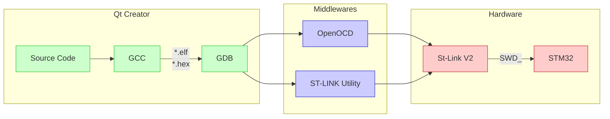

{:.shadow}

На данный момент существует множество IDE для написания прошивок под микроконтроллеры STM32.
[Официальном сайт](https://www.st.com/en/development-tools/stm32-ides.html){:target="\_blank"}
содержит информацию о 25 средах, среди которых есть как платые (например,
  [IAR Emdedded Workbench](https://www.iar.com/iar-embedded-workbench/){:target="\_blank"}) и бесплатные
(например, [STM32CubeIDE](https://www.st.com/content/st_com/en/products/development-tools/software-development-tools/stm32-software-development-tools/stm32-ides/stm32cubeide.html){:target="\_blank"}),
так и те, использование которых больше не рекомендуется.

Стоит отметить, что там есть упоминание о Qt Development Tools, но только для STM32MP1 и для разработки HMI.
>  Tools to develop, debug and deploy HMI on embedded platforms.

В этой статье я покажу, как настройть Qt Creator для написания и отладки прошивок STM32.

---

### Немного теория



Рабочий процесс выглядит так: исходные коды собираются с помощью gcc (и не просто gcc, а спецверсией для микроконтроллеров `arm-none-eabi-gcc`) в файл прошивки с расширением `.elf` или `.hex`. А затем `arm-none-eabi-gdb` осуществляет отладку прошивки в микроконтроллере с помощью OpenOCD или St-Link Utility.

### Настройка по шагам

  1. Установить плагин BareMetal в `Help → About Plugins → Device Support → BareMetal (Experimental)` и перезагрузить Qt Creator, чтобы плагин нормально заработал.
  2. В меню `Tools → Options → Devices → Bare Metal` настроить параметры запуска ST-Link Utility.
 ```
 Startup Mode → Startup in TCP/IP Mode
 Host → localhost, 4242
 Executable file → /где/находится/st-util
 Verbosity level → 0
 Version → ST-LINK/V2
 Init commands → load
 ```
  3. Во вкладке `Devices` нажать на `Add...`, выбрать `Bare Metal Device` и запустить мастер настройки кнопкой `Start Wizard`.
  4. В появившемся окне можно задать любое имя, а в поле `GDB server provider` выбрать `ST-LINK Utility`, который был настроен на прошлом шаге.
 5. Перейти в меню `Tools → Options → Kits → Compilers` и добавить компиляторы C/C++ из arm-none-eabi-gcc.
  * Выбрать `Add → GCC → C`. И указать путь к компилятору C.
  * Выбрать `Add → GCC → C++`. И указать путь к компилятору C++.
 6. Во вкладке `Debuggers` нажать на `Add` и добавить `arm-none-eabi-gdb-py`. `Необходимо добавить именно arm-none-eabi-gdb-py, поскольку Qt Creator требуется отладчик с поддержкой python.`{:.info}
 7. Вернуться во вкладку `Kits` и нажать на `Add`.  
```
Device type → Bare Metal Device
Device → stm32 (Из пункта 4)
Compiler C → arm-none-eabi-gcc (Из пункта 5)
Compiler C++ → arm-none-eabi-g++ (Из пункта 5)
Debugger → arm-none-eabi-gdb-py (Из пункта 6)
Qt version → None
```


<div class="swiper my-3 swiper-demo swiper-demo--image swiper-demo--3">
  <div class="swiper__wrapper">
    <div class="swiper__slide"></div>
    <div class="swiper__slide"></div>
    <div class="swiper__slide"></div>
    <div class="swiper__slide"></div>
    <div class="swiper__slide"></div>
    <div class="swiper__slide"></div>
    <div class="swiper__slide"></div>
  </div>
  <div class="swiper__button swiper__button--prev fas fa-chevron-left"></div>
  <div class="swiper__button swiper__button--next fas fa-chevron-right"></div>
</div>

<script>
  
  var SOURCES = window.TEXT_VARIABLES.sources;
  window.Lazyload.js(SOURCES.jquery, function() {
    $('.swiper-demo--0').swiper();
    $('.swiper-demo--1').swiper();
    $('.swiper-demo--2').swiper();
    $('.swiper-demo--3').swiper();
    $('.swiper-demo--4').swiper({ animation: false });
  });
</script>
