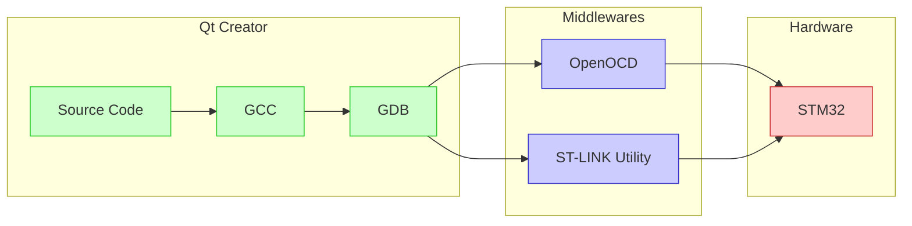

{:.shadow}

На данный момент существует множество IDE для написания прошивок под микроконтроллеры STM32.
[Официальном сайт](https://www.st.com/en/development-tools/stm32-ides.html){:target="\_blank"}
содержит информацию о 25 средах, среди которых есть как платые (например,
  [IAR Emdedded Workbench](https://www.iar.com/iar-embedded-workbench/){:target="\_blank"}) и бесплатные
(например, [STM32CubeIDE](https://www.st.com/content/st_com/en/products/development-tools/software-development-tools/stm32-software-development-tools/stm32-ides/stm32cubeide.html){:target="\_blank"}),
так и те, использование которых больше не рекомендуется.

Стоит отметить, что там есть упоминание о Qt Development Tools, но только для STM32MP1.
>  Tools to develop, debug and deploy HMI on embedded platforms.

В этой статье я покажу, как настройть Qt Creator для написания и отладки прошивок STM32.

---

### Теория

